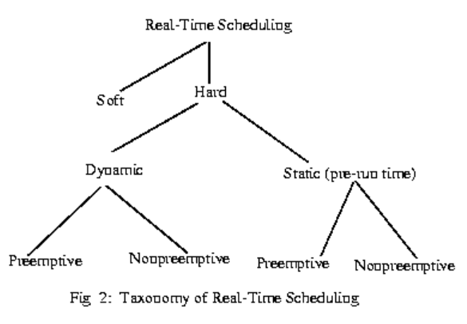

# MPU & MMU
MPU: Memory Protection Unit
MMU: Memory Management Unit

* An MMU is more advanced than an MPU
* An MMU is able to do the job of an MPU
* An MMU is capable of cache control while an MPU is not
* An MMU is capable of bus arbitration while an MPU is not
* An MMU is capable of bank switching while an MPU is not
* An MPU is simpler and uses less overhead than an MMU

详情参考ARM，待补充

---

# Real-Time Systems
* If the result has utility even after the deadline has passed, the deadline is classified as soft, otherwise it is firm. 
* If a catastrophe could result if a firm deadline is missed, the deadline is hard.
* Hard real time system is purely deterministic and time constraint
* Best example for soft real time system is personal computer, audio and video systems, etc.

Characteristics|Hard real-time|Soft real-time
---|---|---
Response time|Hard-required|Soft-desired
Peak-load performance|Predictable|Degraded
Control of pace|Environment|Computer
Safety|Often critical|Non-critical
Size of data files|Small/medium|Large
Redundancy type|Active|Checkpoint-recovery
Data integrity|Short-term|Long-term
Error Detection|Autonomous|User assisted

* Real-time Scheduling

    * Dynamic Scheduling Algorithm
        * Rate Monotonic Algorithm (RMA)
        * Ealriest Deadline-First (EDF) Algorithm
        * The Priority Ceiling Protocol
    * Static Scheduling Algorithms 
        * Most often there is no notion of priority in static scheduling. 
        * Based on task arriaval pattern a time line is built and embedded into the program and no change in schedules are possible during execution.    

[Reference](https://users.ece.cmu.edu/~koopman/des_s99/real_time/)