# AUTOSAR Runtime Environment and Virtual Function Bus
## 1. Introdution
Cooperate on srandards, compete on implementations

## 2. Fundamentals
Adapt to different hardware platforms
* modularization (different independent components)
* different layers of abstraction

### 2.1 Virtual Function Bus
a system modeling and communication concept
virual communication service
mapped ti acutal impelemented methods specific for the underlying hardware infrastructure

### 2.2 Runtime Environment
runtime environment provides an actual representation of the virtual concepts of the VFB for one specic ECU
RTE realizes the interfaces of the Virtual Function Bus
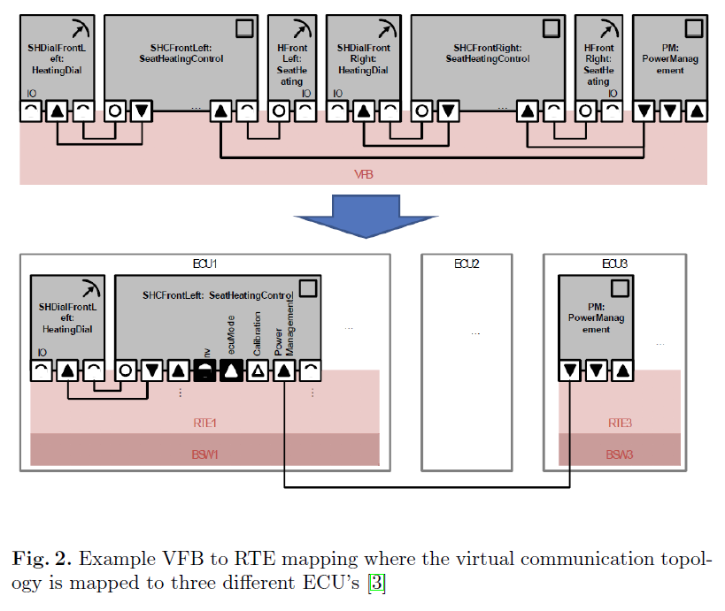

### 2.3 Comparison of VFB and RTE
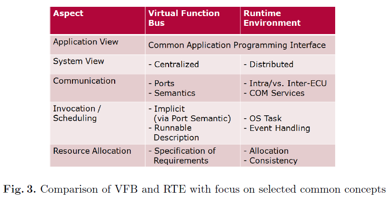

## 3. Responsbilities of the Runtime Environment
### 3.1 Overview
Interfaces:
* AUTOSAR Interface
SWC components as well as ECU Abstraction and Complex Device Drivers
* Standardized AUTOSAR Interface
AUTOSAR services that have a predened and standardized functionality.
* Standardized Interface
Interfaces can not be described using the VFB specification
used by the RTE only, cannot be used directly by other softwarecomponents
e.g. OS has to provide a standardized interface to allow the RTEto consume services like component instantiation or taskscheduling which must not be used by other software components
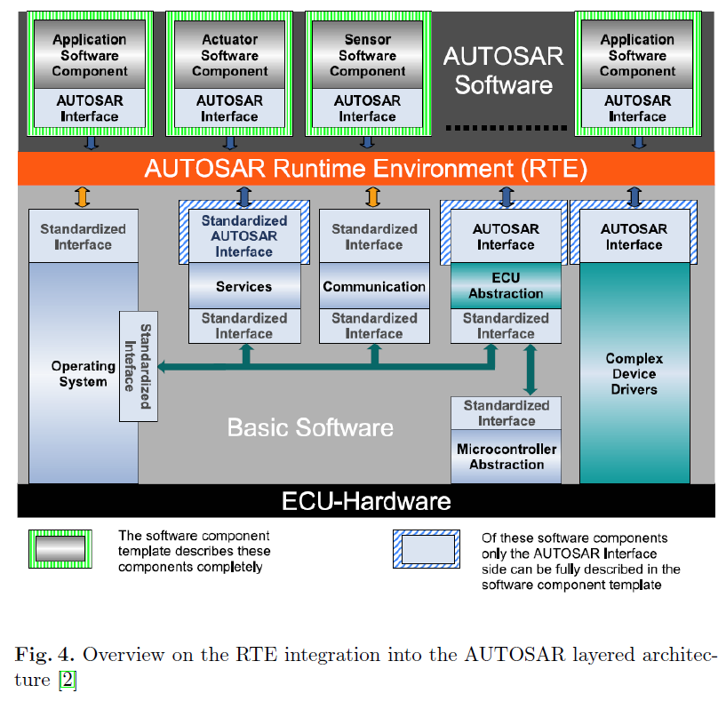

### 3.2 AUTOSAR Software Components
information has to be provided within the Software Component Template and serves as input for the RTE generation
* Hierarchical Structure: the composition of atomic software components, will be used by the RTE to create the required
instances
* Ports and Interfaces: provided and required ports and their communication semantics
* Internal Behaviour: Runnable Entities and RTE Events for the purpose
of scheduling and method invocation
* Specifics of the Implementation: memory consumption, execution
timesa

### 3.3 AUTOSAR Services
logical entity of basic software offering general functionality to be used by AUTOSAR Software Components
* part of the BSW
* attached to the RTE using standarized AUTOSAR interface
the RTE does not provide any mechanisms to access a service from a remote ECU.
a service-to-service communication is not allowed by the AUTOSAR specication

### 3.4 Hardwar-Related Components
ECU abstraction layer to decouple software from hardware.
AUTOSAR interface
But only can be accessed by suitable Sensor/Actuator software components ==?==

## 4. Runnabels
Sequence of instructions that can be started by the RTE

a mapping between operating system tasks and existing runnables is created that is later used by the RTE to define and perform scheduling and execution of the runnables according to their specication.

* Type 1 Runnables terminate within a finite time, mapped to basic tasks
* Type 2 Runnables contains at least one wait point, mapped to extended tasks

### 4.1 Integration
* Operating System View
OS does not know about the concepts of runnables
executed anytime the corresponding OS task is scheduled
* RTE View
Task is structured and controlled using RTE glue code that will control the correct execution of the runnables
* VFB View
during design time of the application, do not conern the integration context of runnables ==template?==
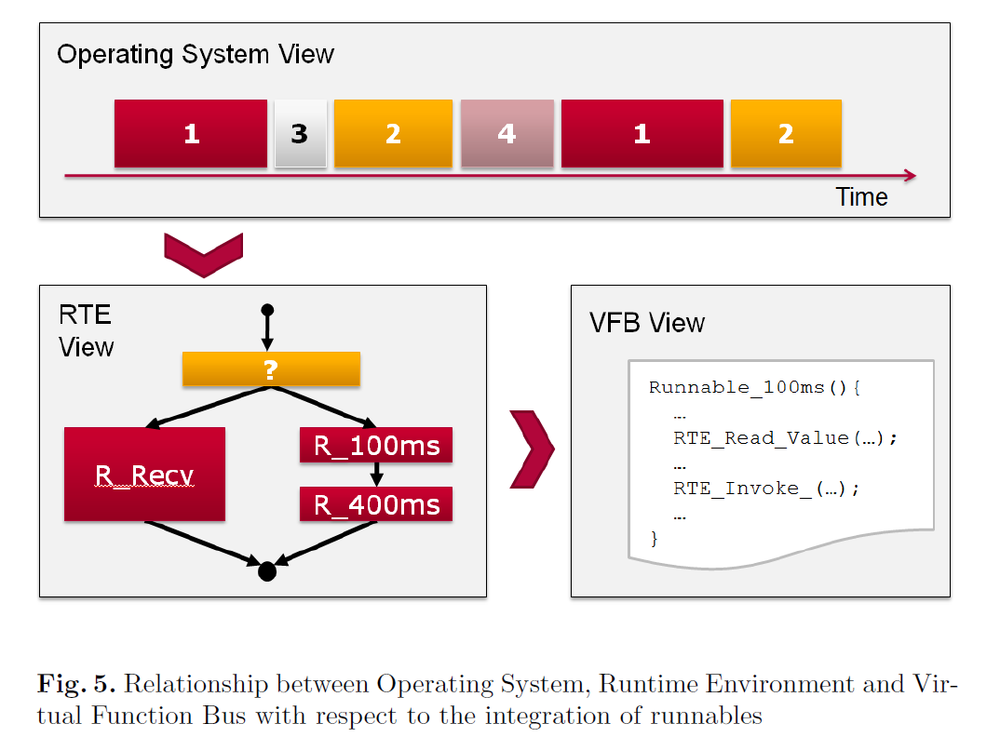
In RTE view, yellow block indicates RTE glue codes, red blocks indicate runnables

### 4.2 RTE Events
to activate or wake up runnables
* Activation
invocation of a runnable instance
* Wake Up
Wait by blocking methods: RTE_Receive() or RTE_Feedback()
Return/Wake up by RTE events

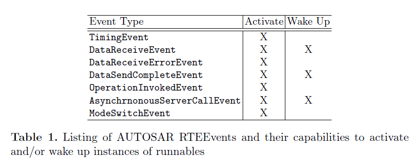

### 4.3 Operating System Task Mapping
* Scenario 1
a single type 1 runnable
* Scenario 2
sequential execution of several type 1 runnables that share a common cycle time
* Scenario 3
continuously checking for RTE Event to decide which of the two category 1 runnables need to be executed
* Scenario 4
type 2 runnable is generally integrated as a standalone runnable in a single extended OS task
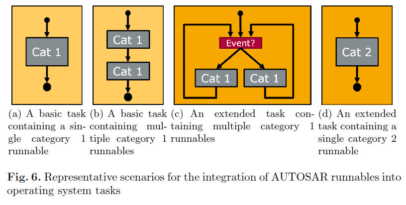

## 5. RTE Implementation
Communication Patterns:
* Sender-Receiver
* Client-Server
Below using the example of the Sender-Receiver pattern
### 5.1 Fundamentals
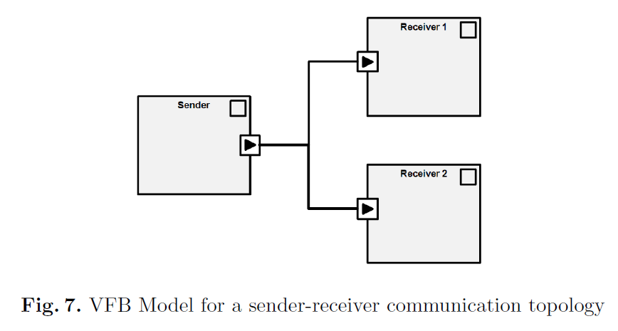
VFB model does not consider the acutal location of the software components
### 5.2 Send/Receive Modes
four different modes of data receive:
* Implicit Receive
provides only a copy of the respective value to the calling instance
* Explicit Receive
provides a non-blocking read operation on the actual variable containing the latest valid value
* Wake up of wait point
to wake up the component if the receive operation has completed successfully
* Activation of runnable entity
is used for runnables that wish to be invoked upon a new DataReceiveEvent and can then choose to either invoke implicit or explicit receive operations to actually retrieve the new value.
==table and above description do not match==
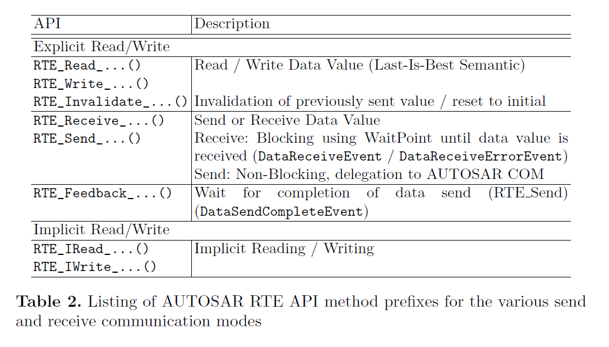
### 5.3 Implementation
#### 5.3.1 API usage
e.g. a receive port named PassengerDetected that provides a single value called val could be read via the RTE API call RTE_Read_PassengerDetected_val() for instance.
==received variable need declaration?==
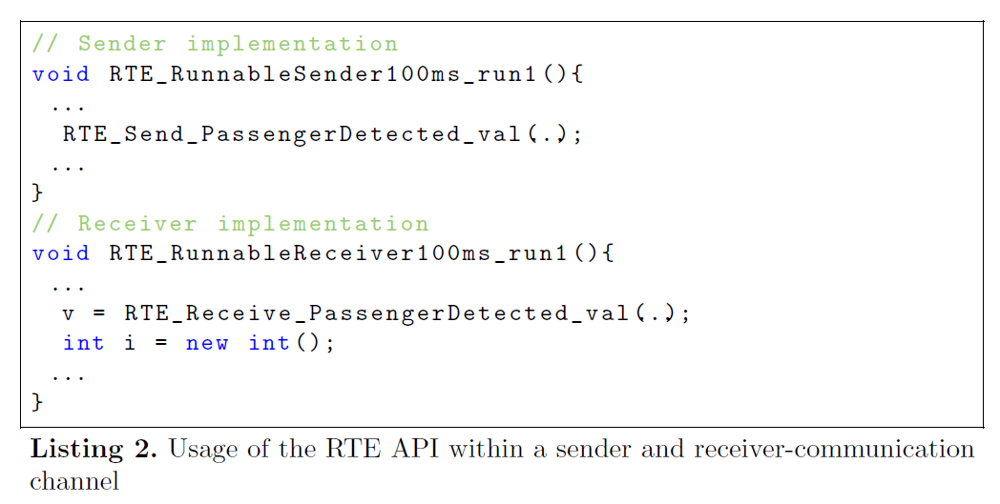
#### 5.3.2 Sender Implementation
* Intra-ECU
a simple write statement to a variable in a shared memory location
* Inter-ECU
Need consume a communication service object
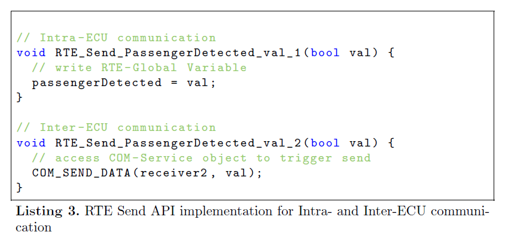
#### 5.3.3 Receiver Implementation
Describe in Table 2 above
Examples
* Case 1: 
explicit reading in an intra-ECU communication
directly reads the local variable that contains the most recent value on the incoming port
* Case 2:
Intra-ECU communication scenario
using a blocking API RTE_Receive() that additionally implements a queue for incoming values
==do not understand==
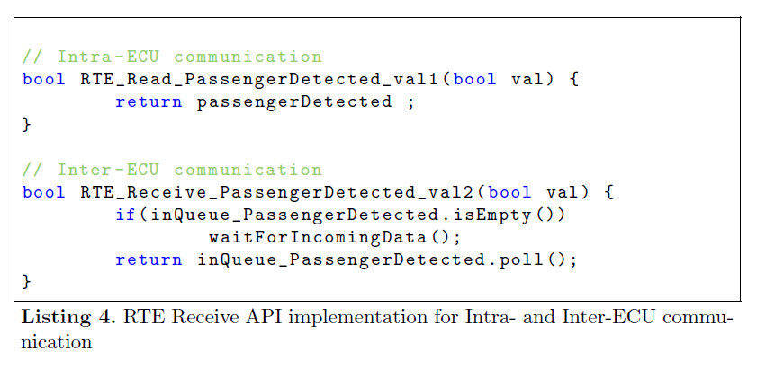

## 6. Hardware Interaction
### 6.1 ECU Abstraction
* provides a unified interface
* closely coupled to the MCAL, which is hardware specific
* MCAL provides access to Digital I/O, Analog/Digital Converter, FLASH, EEPROM
==?==

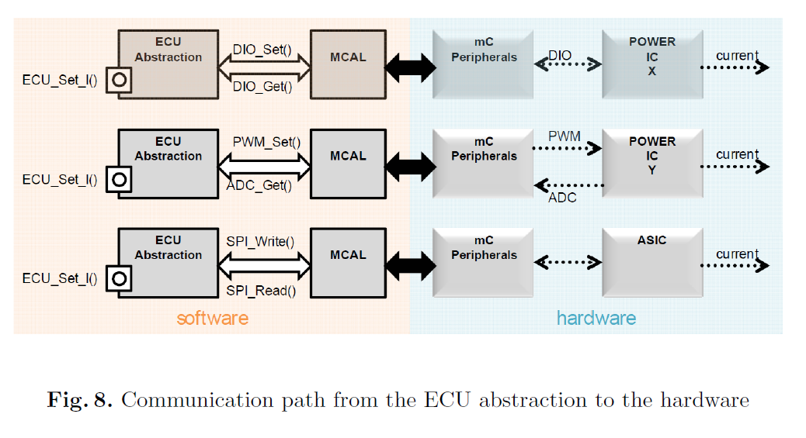

### 6.2 Sensors and Actuators
* Sensor and Actuator Hardware can only be accessed using the interfaces provided by the ECU abstraction
* Only sensor and sctuator software components can access them

### 6.3 Complex Device Drivers
* bypass that hardware restriction for resource critical and/or Non-AUTOSAR compliant software components
* usually for complex sensor or actuator drivers

### 6.4 Architectural Benefits
* relocatability of AUTOSAR software components
* allow to develop components of each layer independently
* interchange components without affecting components from the layers above