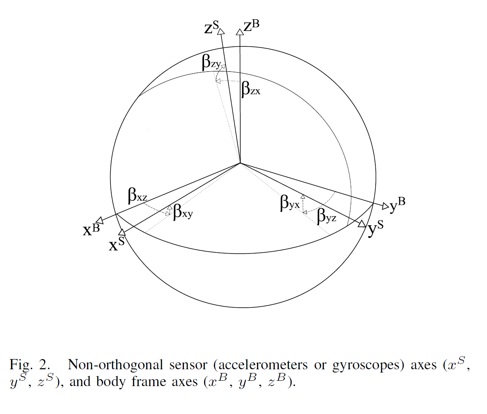

# A Robust and Easy to Implement Method for IMU Calibration without External Equipments

## Introduction

low-cost MEMS based IMU
composed by a set of tri-axial clusters:
* accelerometers
* gyros
* magnetometer cluster

scaling factor：used to convert the digital outputs of the sensors in real physical quantity

Inaccuracy Factors
* non accurate scaling
* sensor axis misalignment
* cross-axis sensitivities
* non-zero biases

expensive commercial IMU: factory calibration

---

**the multi-position method:**

step 1: calibrate the accelerometers
in a static position, the norms of the measured accelerations is equal to the magnitudes of the gravity plus a multisource error factor (i.e., it includes biases, misalignment, noise,...).

step 2：use the gravity vector positions measured by the accelerometers as a reference to calibrate the
gyroscope

step 3: a consistent numerical integration process is essential to mitigate the effect of the signal discretization, usually sampled at 100 Hz.

--- 

**traditional method:**
mechanical platforms such as a robotic manipulator, moving the IMU with known rotational velocities in a set of precisely controlled orientations

Very expensive

---

Methods do not require any external mechanical equipment

## Sensor Error Model

Ideal IMU:
the 3 axes of the accelerometers triad and the 3 axes of the gyroscopes triad define a single, shared, orthogonal 3D frame.

Frames：
AF: accelerometers frame
GF: gyroscope frame
AOF: accelerometers orthogonal ideal frames
GOF: gyroscope orthogonal ideal frames
BF: body frame

---

we assume that the body frame BF coincides with the accelerometers orthogonal frame AOF

**for the accelerometer**

A non-orthogonal frame can be transformed in the orthogonal body frame as
$
a^O = T^a a^S,  
T^a = 	\begin{bmatrix}
   1 & -\alpha_{yz} & \alpha_{zy}\\
   0 & 1 & -\alpha_{zx} \\
   0 & 0 & 1
\end{bmatrix} $

**for the gyroscope**
The reference frame is also AOF

$\omega^O=T^g \omega^S, 
T^g = \begin{bmatrix}
    1 & -\gamma_{yz} & \gamma_{zy}\\
    \gamma_{xz} & 1 & -\gamma_{zx}\\
    -\gamma_{xy} & \gamma_{yx} & 1
\end{bmatrix} $

---

Scaling matrix:
$K^a = \begin{bmatrix}
    s_x^a & 0 & 0\\
    0 & s_y^a & 0 \\
    0 & 0 & s_z^a
\end{bmatrix} $

$K^g = \begin{bmatrix}
    s_x^g & 0 & 0\\
    0 & s_y^g & 0 \\
    0 & 0 & s_z^g
\end{bmatrix} $

Bias vector:
$b^a = \begin{bmatrix}
    b_x^a\\
    b_y^a\\
    b_z^a
\end{bmatrix} $

$b^g = \begin{bmatrix}
    b_x^g\\
    b_y^g\\
    b_z^g
\end{bmatrix} $

---

The complete sensor error model:
for accelerometer
$a^o = T^a K^a (a^S + b^a + \nu^a)$
for gyroscope
$\omega^o = T^g K^g (\omega^S + b^g + \nu^g)$

$\nu$ is the measurement error

## Basic Calibration Framework
The parameters to be estimated for accelerometer:

$\theta^{acc} = [\alpha_{yz}, \alpha_{zy}, \alpha_{zx}, s_x^a, s_y^a, s_z^a, b_x^a, b_y^a, b_z^a]$

$a^O = h(a^S, \theta^{acc}) = T^aK^a(a^S + b^a)$

We can extract M acceleration vectors $a_k^s$
(measured in the non-orthogonal AF), averaging the accelerometers readings in a temporal window inside each static interval

Cost function:

$L(\theta^{acc}) = \sum_{k=1}^M(\|g\|^2 - \|h(a_k^S, \theta ^{acc})\|^2 )^2 $

where $\| g \|$ is the actual magnitude of the local gravity

Levenberg-Marquardt algorithm to minimize the cost

---
  
$u_{g,k} = \psi[\omega_i^S,u_{a,k-1}]$

$\omega_i^s$ is a sequence of n gyroscope reading between $(k-1)^{th}$ and $k^{th}$ static intervals
$u_{a,k-1}$ is the initial gravity versor (a unit quaternion)
$u_{g,k}$ is the final gravity versor
$\psi$ denotes integration algorithm 

The unknown parameter vector is
$\theta^{gyro} = [\gamma_{yz}, \gamma_{zy}, \gamma_{xz}, \gamma_{zx}, \gamma_{xy}, \gamma_{yx}, s_x^g, s_y^g, s_z^g]$

The cost function is
$L(\theta^{gyro}) = \sum_{k=2}^M \| u_{a,k} - u_{g,k} \|^2$

where M is the number of static intervals
$u_{a,k}$ is the accleration versor measured by averaging the calibrated acclerator readings within the $k^{th}$ static interval

Levenberg-Marquardt algorithm to minimize the cost

## Calibration Procedure

### A. Static Detector

The accuracy of the calibration strongly depends on the reliability in the classification between static (accelerometer) and motion intervals (gyroscope)

a variance based static detector operator

### B. Runge-Kutta Integration

Given a common instruments rate of 100 Hz
Runge-Kutta 4th order normalized method (RK4n) outperforms the standard linear integration procedure

the quaternion kinematics:
$f(q,t) = \dot{q} = \frac{1}{2}\Omega(\omega(t))q$

$\Omega(\omega) = \begin{bmatrix}
0 & -\omega_x & -\omega_y & -\omega_z \\
\omega_y & 0 & \omega_z & -\omega_y \\
\omega_y & -\omega_z & 0 & \omega_x \\
\omega_z & \omega_y & -\omega_x & 0
\end{bmatrix}$

The RK4n integration algorithm is
$q_{k+1} = q_k + \Delta t \frac{1}{6}(k_1 + 2k_2 + 2k_3 +k_4) $
$k_i = f(q^{(i)}, t_k+c_i \Delta t)$
$q^{(i)} = q_k$ &emsp;&emsp;&emsp;&emsp;&emsp;&emsp;&emsp;&emsp;&emsp; for $i=1$
$q^{(i)} = q_k + \Delta t \sum_{j=1}^{i-1}a_{ij}k_j$&emsp;for $i>1$

for each step, we need to normalize the $(k+1)^{th}$ quaternion:
$q_{k+1} \rarr \frac{q_{k+1}}{\|q_{k+1}\|}$

### C. Allan Variance
We characterize the random gyroscope bias drifts using the Allan variance

### D. Complete Procedure

To avoid unobservability in the calibration parameters estimation, a minimum of nine different attitudes has to be collected

a higher number N of distinct attitudes are required to get better calibration results

With $36 \leq N \leq 50$ and $1 sec \leq t_{wait} \leq 4 sec$, we obtain a good trade-off between calibration accuracy, biases stability, and noise reduction

The duration of the initialization period $T_{init}$ is given by the Allan variance analysis

https://www.cnblogs.com/buxiaoyi/p/7541974.html#imu%E8%AF%AF%E5%B7%AE%E6%A8%A1%E5%9E%8B%E5%92%8C%E6%A0%A1%E5%87%86