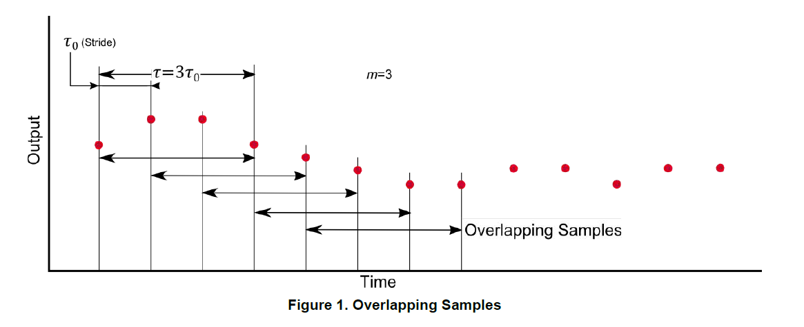
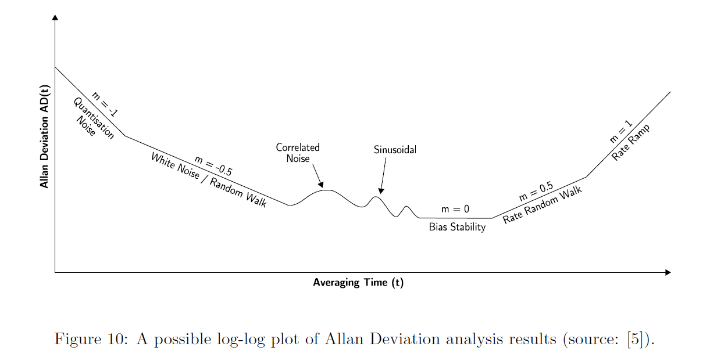
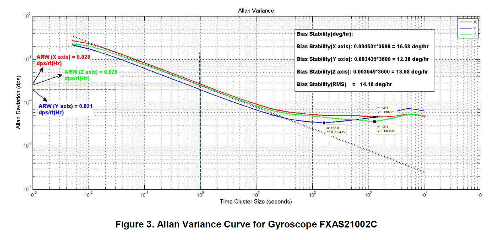

# Allan Variance: Noise Analysis for Gyroscopes

To determine the intrinsic noise in a system as a function of the averaging time

five basic noise terms appropriate for inertial sensor data：
* quantization noise
* angle random walk
* bias instability
* rate random walk
* rate ramp

## Allan Deviation Plot

1. Acquire a time history of the gyroscope's output (keeping the gyro static). sampling period is $\tau_0$, and $N$ samples in total

2. Set the averaging time to be $m\tau_0$, where m is the averaging factor, which should be less than $(N-1)/2$

3. Divide the time hostory into into clusters of finite time duration of $\tau = m \tau_0$. The time stride is set to be $\tau_0$ to maximize the use of the data

4. Compute the Alan variance
* **Method 1**: Averages of the output rate samples (over each cluster)

Step1: Calculate $\theta$ corresponding to each gyro output sample

$\theta(t) = \intop^t{\Omega(t^{\prime})dt^{\prime}} $
    
For a discrete set of samples, a cumulative sum can also be used

Step2: Calculate the Allan variance as

$\sigma^2(\tau) = \frac{1}{2\tau^2}<(\theta_{k+2m} - 2 \theta_{k+m}+ \theta_k)^2>$

where $<>$ represents the ensemble average
after expand it, we can get

$\sigma^2(\tau) = \frac{1}{2\tau^2(N-2m)}\sum_{k=1}^{N-2m}{(\theta_{+2m} - 2 \theta_{k+m} + \theta_k)^2}$

* **Method 2**: Output angles $\theta$ corresponding to each gyro rate sample

Step1:

Step2:

5. Finally, calculate the Allan deviation value for that particular value of $\tau$, and then obtain the Allan deviation plot by repeating the steps for ==multiple values of $\tau$==

root Allan variance or the Allan deviation for a particular value of $\tau$

$ADEV = \sqrt{AVAR(\tau)}$

Allan deviation (ADEV)
Allan variance (AVAR)

The Allan deviation plot is normally plotted as values of Allan deviation over $\tau$ on a log-log plot.

## Noise Indetification

For a MEMS device such as a gyroscope, the important processes to be measured are random walk and bias instability (sometimes also called bias stability)

零偏（Bias）：不多解释。

零偏稳定性（Bias stability，In-Run Bias Stability）：衡量在一次上电过程中，零偏的变化，单位大多为°/h。是陀螺最为重要的指标，工程上常用一段时间采样平均值的方差来衡量。但是平滑时间是不固定的，如果是光纤陀螺，平滑时间通常为10s，如果是激光陀螺，平滑时间通常为100s（注1），MEMS的平滑时间为10s。它体现的是陀螺仪的综合性能。

零偏不稳定性（Bias instability）：单位大多为°/h，这个参数是用Allan方差计算的，是Allan方差的最低点，与陀螺的零偏稳定性单位相同，但是二者的数值没有固定的关系。

零偏重复性（Run-Run Bias Stability）：单位大多为°/h，是衡量每一次陀螺上电的零偏的变化，测试时注意每一次上电之间的间隔要大一些，10-20min比较稳妥。

角度随机游走（Angular random walk，ARW）：利用Allan方差来计算，单位为°/√h。工程上可以理解为衡量陀螺白噪声方差的一个量，二者有一定的换算关系。

速率噪声密度（Rate Noise Density，RND）: 利用Allan方差来计算，单位为°/sec/√Hz。工程上可以理解为衡量陀螺白噪声方差的一个量，与角度随机游走相同二者有一定的换算关系。

角速度随机游走（Rate Random Walk，RRW）：利用Allan方差来计算，单位为 °/ (h)^1.5。陀螺的角速率输出随着时间缓慢变化，通常由系统误差引起，比如环境温度的缓慢变化。可以用来衡量零偏的变化规律。

速率斜坡(Rate Ramp)：利用Allan方差来计算，单位为 °/ (h)^2陀螺的角速率输出随着时间缓慢变化，通常由系统误差引起，比如环境温度的缓慢变化，可以通过严格的环境控制或引入补偿来降低此类误差。

