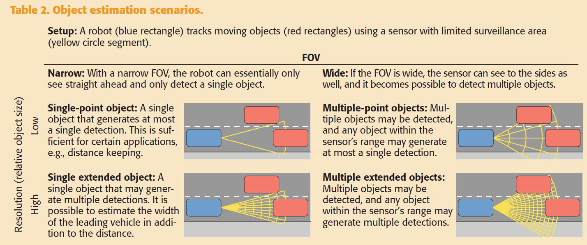

The analogy between 
* Bayesian state estimation of a single object 
* random finite set (RFS) estimation for multiple objects

recursive Bayesian framework

A simpler approach is to only propagate the first-order moment of the single-object state, called the expected value.

## Multiple-Object State Estimation
### Problems
* False alarms, i.e. clutter detections
* The detection origin is unknown
* The number of objects is unknown

### Data Handling
* New target appearing - object birth
* Old target disappearing - object death
Approaches:
* M/N logic
* the score-based approach
### Data Association
associate each detection to one of the detection generating sources:
* object source
    * existing objects
    * newly appeared objects
* clutter source
#### multiple-point object scenario
at most one detection can be caused by each source
Solutions:
* global nearest neighbor (GNN)
* joint probabilistic data association (JPDA)
* multiple hypothesis tracking (MHT)
* joint compatibility branch and bound (JCBB)
#### multiple extended object scenario
at most one cell of detections can be caused by each source
a cell of detections is a nonempty subset of the full set of detections
In the measurement update, each partition must have a likelihood that corresponds to how probable the partition is.

to use random set methods, which relax the need for solving the data association problem and the need for data handling.
## Multiple-Object Bayesian State Estimation
### RFS
A random variable $\gamma$ that draws its instantiations $\gamma = Y$ from the hyperspace $y$ of all subsets $Y$ (the null set $\Phi$ included) of some underlying space $y_0$
$y_0=R^n$ is the Eculidean vector space
the moving objects' states are vector of
* positions
* kinematics
    * velocity
    * acceleration
    * heading
    * turn rate
* for extended objects
    * shape
    * size
    * orientation of the object's extension

$Y_k = \{y_k^{(j)}\}_{j=1}^{N_{y,k}}$
where $N_{y,k}$ is a discrete random variable
$y_k^{(j)}$ is a random vector

### RFS motion model
* The time evolution of objects that are already located in the surveillance area RFS $F(x_k)$
    * still located in the surveillance area in the next time step modelled by the same type of motion models $f(\cdot)$ with different parameters for each object
    * the disappearance of existing objects captured by a state-dependent probability of survival $p_s(x_k)$
* The appearance of new objects in the surveillance area 
    * an object that spawns from an already existing object RFS $S(x_k)$
    * entirely new object RFS $\varGamma_k$

### RFS measurement model
* It captures how many detections an object will generate and how each detection relates to the object’s state RFS $H(x_k)$
    * to model the number of detections as Poisson distributed $\gamma(x_k)$
    * Given the number of detections, how the set of detections relates to the object’s state is described with a measurement model $h(\cdot)$
    * Missed detection and occlusion by other objects is captured by a state-dependent probability of detection $p_D(x_k)$
* It captures how many false detections there are and how these are distributed

### Bayesian Recursion

## Computationally Tractable RFS Filters