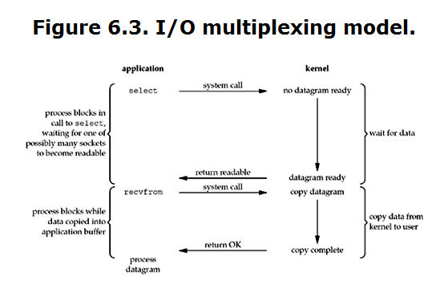
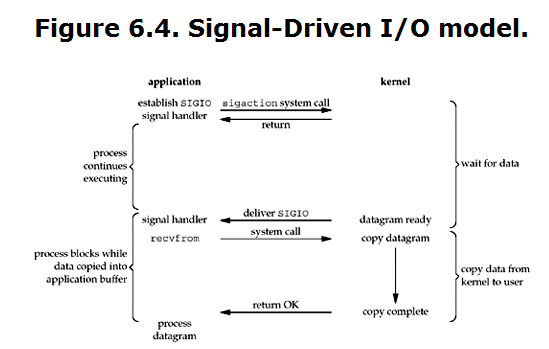
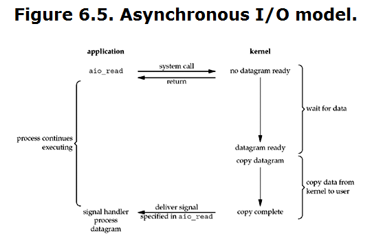
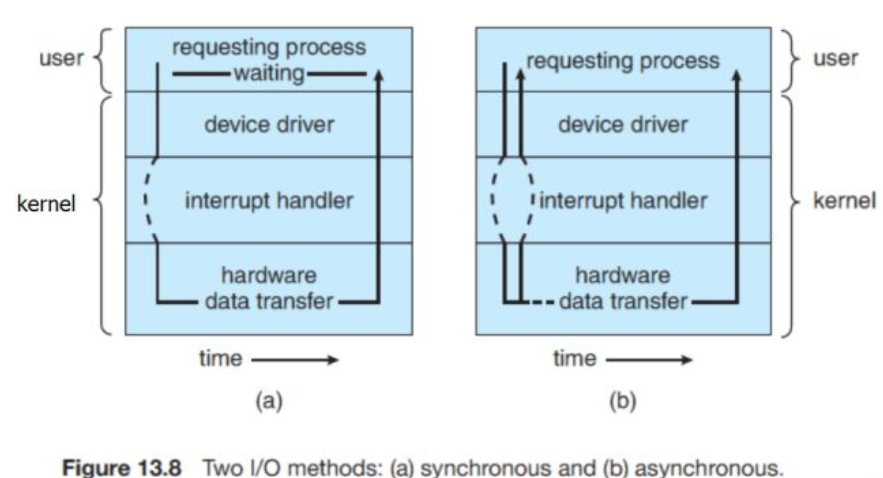

https://www.zhihu.com/question/19732473/answer/241673170

## 进程切换
当一个程序正在执行的过程中， 中断（interrupt） 或 系统调用（system call） 发生可以使得 CPU 的控制权会从当前进程转移到操作系统内核。

中断：
CPU 微处理器有一个中断信号位， 在每个CPU时钟周期的末尾, CPU会去检测那个中断信号位是否有中断信号到达， 如果有， 则会根据中断优先级决定是否要暂停当前执行的指令， 转而去执行处理中断的指令。 （其实就是 CPU 层级的 while 轮询）

时钟中断
一个硬件时钟会每隔一段（很短）的时间就产生一个中断信号发送给 CPU，CPU 在响应这个中断时， 就会去执行操作系统内核的指令， 继而将 CPU 的控制权转移给了操作系统内核， 可以由操作系统内核决定下一个要被执行的指令。

系统调用
system call 是操作系统提供给应用程序的接口。 用户通过调用 systemcall 来完成那些需要操作系统内核进行的操作， 例如硬盘， 网络接口设备的读写等。

对于一个运行着 UNIX 系统的现代 PC 来说， 进程切换通常至少需要花费 300 us 的时间

---

## 进程阻塞
阻塞是指进程在发起了一个系统调用（System Call） 后， 由于该系统调用的操作不能立即完成，需要等待一段时间，于是内核将进程挂起为等待 （waiting）状态， 以确保它不会被调度执行， 占用 CPU 资源。

阻塞和非阻塞描述的是进程的一个操作是否会使得进程转变为“等待”的状态， 但是为什么我们总是把它和 IO 连在一起讨论呢？

原因是，阻塞这个词是与系统调用 System Call 紧紧联系在一起的，因为要让一个进程进入 等待（waiting） 的状态, 要么是它主动调用 wait() 或 sleep() 等挂起自己的操作，另一种就是它调用 System Call, 而 System Call 因为涉及到了 I/O 操作，不能立即完成，于是内核就会先将该进程置为等待状态，调度其他进程的运行，等到它所请求的 I/O 操作完成了以后， 再将其状态更改回 ready 。

操作系统内核在执行 System Call 时， CPU 需要与 IO 设备完成一系列物理通信上的交互， 其实再一次会涉及到阻塞和非阻塞的问题， 例如， 操作系统发起了一个读硬盘的请求后， 其实是向硬盘设备通过总线发出了一个请求，它即可以阻塞式地等待IO 设备的返回结果，也可以非阻塞式的继续其他的操作。 在现代计算机中，这些物理通信操作基本都是异步完成的， 即发出请求后， 等待 I/O 设备的中断信号后， 再来读取相应的设备缓冲区。 但是，大部分操作系统默认为用户级应用程序提供的都是阻塞式的系统调用 （blocking systemcall）接口， 因为阻塞式的调用，使得应用级代码的编写更容易（代码的执行顺序和编写顺序是一致的）。

---

## 非阻塞调用和异步调用
现在的大部分操作系统也会提供非阻塞I/O 系统调用接口（Nonblocking I/O system call）。 一个非阻塞调用不会挂起调用程序， 而是会立即返回一个值， 表示有多少bytes 的数据被成功读取（或写入）。

非阻塞I/O 系统调用( nonblocking system call )的另一个替代品是 异步I/O系统调用 （asychronous system call）。 与非阻塞 I/O 系统调用类似，asychronous system call 也是会立即返回， 不会等待 I/O 操作的完成， 应用程序可以继续执行其他的操作， 等到 I/O 操作完成了以后，操作系统会通知调用进程（设置一个用户空间特殊的变量值 或者 触发一个 signal 或者 产生一个软中断 或者 调用应用程序的回调函数）。

此处， 非阻塞I/O 系统调用( nonblocking system call ) 和 异步I/O系统调用 （asychronous system call）的区别是：

一个非阻塞I/O 系统调用 read() 操作立即返回的是任何可以立即拿到的数据， 可以是完整的结果， 也可以是不完整的结果， 还可以是一个空值。而异步I/O系统调用 read（）结果必须是完整的， 但是这个操作完成的通知可以延迟到将来的一个时间点。

---

## Unix IO Model

## Blocking I/O

## Nonblocking I/O

## I/O multiplexing
With I/O multiplexing, we call select or poll and block in one of these two system calls, instead of blocking in the actual I/O system call

Comparing Figure 6.3 to Figure 6.1, there does not appear to be any advantage, and in fact, there is a slight disadvantage because using select requires two system calls instead of one. But the advantage in using select, which we will see later in this chapter, is that we can wait for more than one descriptor to be ready.
## Signal Driven I/O 
We can also use signals, telling the kernel to notify us with the SIGIO signal when the descriptor is ready. 

The advantage to this model is that we are not blocked while waiting for the datagram to arrive.
## Asynchronous I/O 
The main difference between this model and the signal-driven I/O model in the previous section is that with signal-driven I/O, the kernel tells us when an I/O operation can be initiated, but with asynchronous I/O, the kernel tells us when an I/O operation is complete.

We call aio_read (the POSIX asynchronous I/O functions begin with aio_ or lio_) and pass the kernel the descriptor, buffer pointer, buffer size (the same three arguments for read), file offset (similar to lseek), and how to notify us when the entire operation is complete. This system call returns immediately and our process is not blocked while waiting for the I/O to complete. We assume in this example that we ask the kernel to generate some signal when the operation is complete. This signal is not generated until the data has been copied into our application buffer, which is different from the signal-driven I/O model.

## Blocking I/O versus Nonblocking I/O
阻塞IO调用 ：在用户进程（线程）中调用执行的时候，进程会等待该IO操作，而使得其他操作无法执行。

非阻塞IO调用：在用户进程中调用执行的时候，无论成功与否，该IO操作会立即返回，之后进程可以进行其他操作（当然如果是读取到数据，一般就接着进行数据处理）。

## Synchronous I/O versus Asynchronous I/O
The first four I/O models—blocking, nonblocking, I/O multiplexing, and signal-driven I/O—are all synchronous because the actual I/O operation (recvfrom) blocks the process. Only the asynchronous I/O model matches the asynchronous I/O definition.

